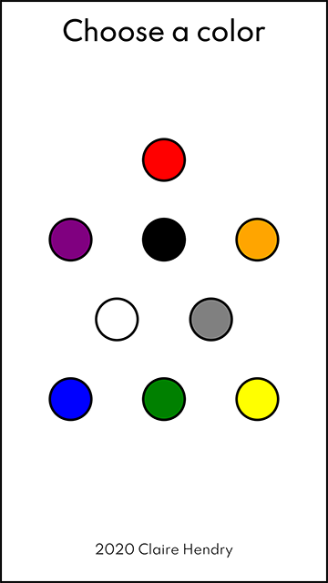
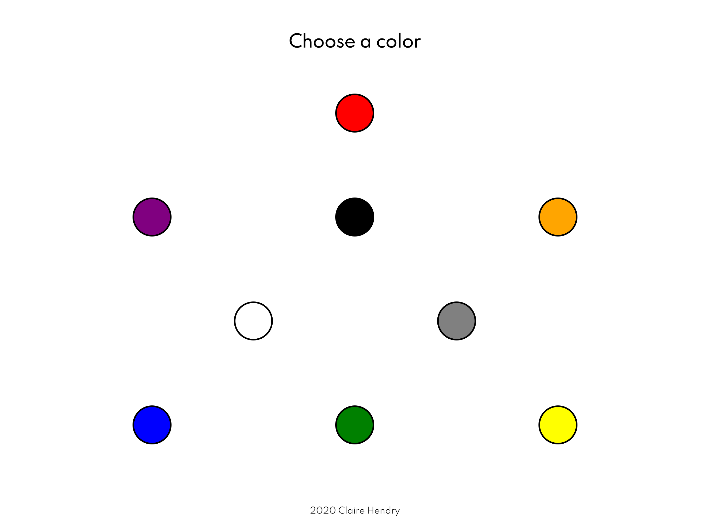

# Name: Nature Image Generator
============================

[Live](https://clairedhendry.github.io/Nature-Image-Generator/ "Nature Image Generator")
----------------------------------------------------------------------------------------

## About

Nature Image Generator creates a unique slideshow of images based on color input. Each color generates an image collection of nature/landscape images that fall into that color range. 

TO USE:
Choose a color to begin the slideshow.
Click on the slideshow at anytime to choose a new color.

Images are fetched using the [Pixabay](https://www.pixabay.com) API. 

### Future Features

With the goal to become a single app for creating ambient and relaxing images and sounds, Nature Image Generator will also create a unique soundscape based on color input. The sounds will complement the images; e.g. "green" will return forest images with the sounds of a bubbling stream and birds.

### Screenshots

Homepage / Color Selector for Mobile/Portrait View

Homepage / Color Selector for Desktop/Landscape View

Example Image for Mobile/Portrait View

Example Image for Desktop/Landscape View

### Technology Used

HTML/CSS/Javascript/jQuery

#### Author

Claire D Hendry 2020

